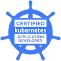

# CKAD Exam preparation

My practice journey for the preparation of my certification exam in Kubernetes [CKAD](https://trainingportal.linuxfoundation.org/learn/course/certified-kubernetes-application-developer-ckad/exam/exam?page=1). Below is a list links that I study and learn that helped me passed the exam.

## Resources
- [CKAD Exercises in Github](https://github.com/dgkanatsios/CKAD-exercises)
- [Udemy Course by Kode Kloud](https://www.udemy.com/course/certified-kubernetes-application-developer/learn/lecture/12316810#overview)
- [Killer SH](https://killer.sh/dashboard)
